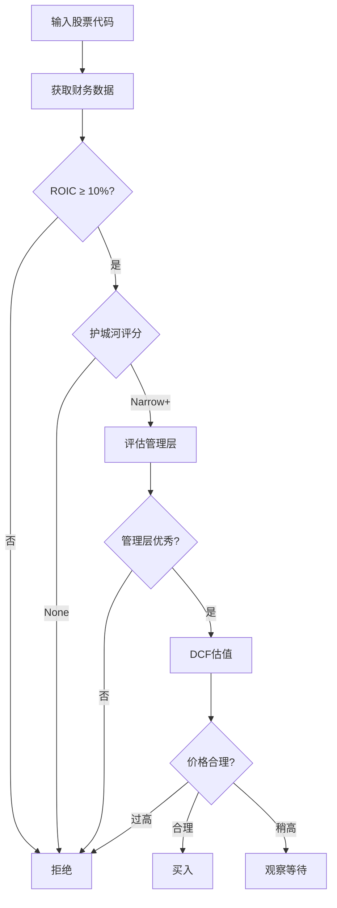

**作者**: InvestIntel AI Team  
**版本**: 1.0.0  
**最后更新**: 2026-01-11  
**标签**: value-investing, quality-stocks, warren-buffett, moat-analysis  
**依赖**: [financial-data, graham-value-investing]

---

## 📖 技能描述

Warren Buffett的质量价值投资方法，强调以合理价格购买优质企业。本技能实现Buffett的核心投资理念和评估标准。

### 核心理念

1. **护城河** (Economic Moat) - 持续竞争优势
2. **ROIC > 10%** - 优秀的资本回报率
3. **公允价格** - 不必深度折价，但要合理
4. **持有 forever** - 时间是优秀企业的朋友

> "It's far better to buy a wonderful company at a fair price than a fair company at a wonderful price."
> — Warren Buffett

---

## 🎯 投资标准

### 1. ROIC/ROE要求

```yaml
minimum_roic: 0.10  # 10%最低ROIC
preferred_roic: 0.15  # 15%首选ROIC
minimum_roe: 0.15  # 15%最低ROE
preferred_roe: 0.20  # 20%首选ROE
```

**重要性**: ROIC是衡量企业使用资本效率的最佳指标。

### 2. 护城河评估

**护城河类型**:

1. **品牌价值** - 强大的品牌认知
2. **成本优势** - 规模经济或资源优势
3. **转换成本** - 用户难以切换
4. **网络效应** - 最强大的护城河

**护城河评分**:
```yaml
MoatScore:
  None: 0        # 无护城河
  Narrow: 1      # 窄护城河 (5-10年可持续)
  Wide: 2         # 宽护城河 (10-20年可持续)
  VeryWide: 3     # 极宽护城河 (20年以上可持续)
```

### 3. 管理层评估

```yaml
capital_allocation: # 资本配置能力
  - 回购股票而非盲目多元化
  - 在ROIC > WACC时再投资
  - 股东友好政策

transparency: # 透明度
  - 清晰的财务报告
  - 坦诚承认错误
  - 与股东沟通顺畅
```

### 4. DCF估值

**简化的DCF方法**:
```
FCF = 自由现金流
g = 可持续增长率 (通常5-8%)
r = WACC (加权平均资本成本，通常8-12%)
TV = 终值 (通常使用2-3%永续增长率)

内在价值 = Σ(FCF_t / (1+r)^t) + (TV / (1+r)^10)
```

---

## 🔍 分析方法

### 方法1: 护城河分析

```python
def evaluate_moat(company):
    """
    评估企业护城河
    
    评分维度:
    1. 品牌价值 (0-25分)
    2. 成本优势 (0-25分)
    3. 转换成本 (0-25分)
    4. 网络效应 (0-50分，加权)
    
    Args:
        company: 公司数据
    
    Returns:
        MoatScore (None/Narrow/Wide/VeryWide)
    """
    score = 0
    
    # 1. 品牌价值 (25分)
    if has_strong_brand(company):
        if brand_is_dominant(company):
            score += 25  # Apple, Coca-Cola级别
        elif brand_is_recognized(company):
            score += 15  # 知名品牌
        elif brand_is_emerging(company):
            score += 5   # 新兴品牌
    
    # 2. 成本优势 (25分)
    if has_cost_advantage(company):
        if scale_advantage(company):
            score += 15  # 规模经济
        if resource_advantage(company):
            score += 10  # 资源垄断
    
    # 3. 转换成本 (25分)
    if has_high_switching_cost(company):
        if embedded_in_workflow(company):
            score += 20  # 工作流必需
        elif data_lockin(company):
            score += 15  # 数据锁定
        elif contracts(company):
            score += 10  # 合同约束
    
    # 4. 网络效应 (50分 - 最强大)
    if has_network_effects(company):
        if metcalfe_law_scaling(company):
            score += 50  # 强网络效应
        elif two_sided_market(company):
            score += 30  # 双边市场
    
    # 判定护城河级别
    if score >= 80:
        return MoatScore.VeryWide
    elif score >= 50:
        return MoatScore.Wide
    elif score >= 20:
        return MoatScore.Narrow
    else:
        return MoatScore.None
```

### 方法2: ROIC计算

```python
def calculate_roic NOPAT(ebit, tax_rate):
    """
    计算税后营业净利润
    """
    return ebit * (1 - tax_rate)

def calculate_roic(nopat, invested_capital):
    """
    计算ROIC (Return on Invested Capital)
    
    ROIC = NOPAT / 投入资本
    
    投入资本 = 股东权益 + 有息负债 - 现金及 equivalents
    """
    if invested_capital <= 0:
        return 0.0
    
    return nopat / invested_capital

def assess_roic_quality(roic, wacc):
    """
    评估ROIC质量
    
    Args:
        roic: 资本回报率
        wacc: 加权平均资本成本
    
    Returns:
        质量评级
    """
    if roic >= wacc * 2:
        return "excellent"  # 优秀
    elif roic >= wacc * 1.5:
        return "very_good"  # 很好
    elif roic >= wacc:
        return "good"  # 合格
    else:
        return "poor"  # 差 (毁灭价值)
```

### 方法3: Buffett综合评分

```python
def calculate_buffett_score(financial_data, moat_analysis):
    """
    计算Buffett综合评分
    
    评分维度:
    1. ROIC/ROE (0-30分)
    2. 护城河 (0-30分)
    3. 管理层质量 (0-20分)
    4. 估值合理性 (0-20分)
    
    Args:
        financial_data: 财务数据
        moat_analysis: 护城河分析
    
    Returns:
        Buffett评分 (0-100)
    """
    score = 0
    
    # 1. ROIC/ROE (30分)
    roic = financial_data.get('roic', 0)
    if roic >= 0.20:
        score += 30
    elif roic >= 0.15:
        score += 25
    elif roic >= 0.10:
        score += 20
    elif roic >= 0.08:
        score += 10
    
    # 2. 护城河 (30分)
    moat_score = moat_analysis.get('score', 0)
    score += (moat_score / 3) * 30
    
    # 3. 管理层质量 (20分)
    management_score = financial_data.get('management_score', 0)
    score += (management_score / 100) * 20
    
    # 4. 估值合理性 (20分)
    # Buffett愿意为高质量公司支付合理价格
    intrinsic_value = moat_analysis.get('intrinsic_value', 0)
    current_price = financial_data.get('current_price', 0)
    
    if intrinsic_value > 0 and current_price > 0:
        upside = (intrinsic_value - current_price) / current_price
        if upside >= 0.20:  # 20%+ 上涨空间
            score += 20
        elif upside >= 0.10:
            score += 15
        elif upside >= 0.05:
            score += 10
        elif upside >= 0:
            score += 5
    
    return min(int(score), 100)
```

---

## 📊 决策流程

### Buffett投资决策树



### 输出格式

```json
{
  "symbol": "AAPL",
  "analysis_type": "buffett_quality_value",
  "recommendation": "buy",
  "confidence": 0.90,
  
  "quality_metrics": {
    "roic": 0.35,
    "roe": 0.147,
    "roa": 0.28,
    "gross_margin": 0.45,
    "net_margin": 0.25
  },
  
  "moat_analysis": {
    "moat_score": "Wide",
    "score": 75,
    "factors": {
      "brand_value": 20,
      "cost_advantage": 15,
      "switching_cost": 15,
      "network_effects": 25
    },
    "reasoning": "强大的生态系统、高品牌价值、高转换成本"
  },
  
  "management_assessment": {
    "score": 85,
    "capital_allocation": "excellent",
    "transparency": "high",
    "shareholder_friendly": true
  },
  
  "valuation": {
    "intrinsic_value": 185.00,
    "current_price": 155.00,
    "upside": 0.194,
    "fair_price": 170.00,
    "valuation": "reasonable"
  },
  
  "buffett_score": 88,
  
  "reasoning": "ROIC高达35%，拥有宽护城河，管理层优秀，价格合理。",
  
  "risk_factors": [
    "高估值可能压缩回报空间",
    "大市值难以快速成长"
  ],
  
  "holding_period": "10+ years",
  "position_size_range": [0.15, 0.25],
  
  "timestamp": "2026-01-11T10:30:00Z"
}
```

---

## 🛠️ 允许的工具

```yaml
allowed_tools:
  - financial-data:
      - get_income_statement
      - get_balance_sheet
      - get_cash_flow_statement
      - get_roic_history
      - get_roe_history
  
  - market-data:
      - get_company_info
      - get_competitors
      - get_industry_analysis
  
  - moat-analysis:
      - evaluate_brand_strength
      - assess_cost_advantage
      - analyze_switching_costs
      - detect_network_effects
  
  - management:
      - get_capital_allocation_history
      - get_shareholder_returns
      - analyze_insider_trading
  
  - valuation:
      - calculate_dcf
      - calculate_wacc
      - estimate_growth_rate
```

---

## 📚 参考资源

- Berkshire Hathaway Shareholder Letters (1965-2024)
- Warren Buffett's Investment Principles
- The Moat by Morningstar
- Competitive Advantage by Michael Porter

---

## ⚠️ 重要提示

### 与Graham方法的区别

| 维度 | Graham | Buffett |
|------|--------|---------|
| 安全边际 | 30-40% | 合理价格即可 |
| 质量 | 次要 | 首要 |
| ROIC要求 | 无 | >10% |
| 护城河 | 不强调 | 核心标准 |
| 持有期 | 2-3年 | Forever |

### 最佳实践

1. **优先考虑质量** - 先找优秀企业，再看价格
2. **可以支付合理价格** - 不必等待深度折价
3. **长期持有** - 时间是朋友
4. **与Graham结合** - 用Graham筛选，用Buffett确认质量
5. **Munger最后检查** - 寻找Lollapalooza效应

---

**变更历史**:
- v1.0.0 (2026-01-11) - 初始版本
